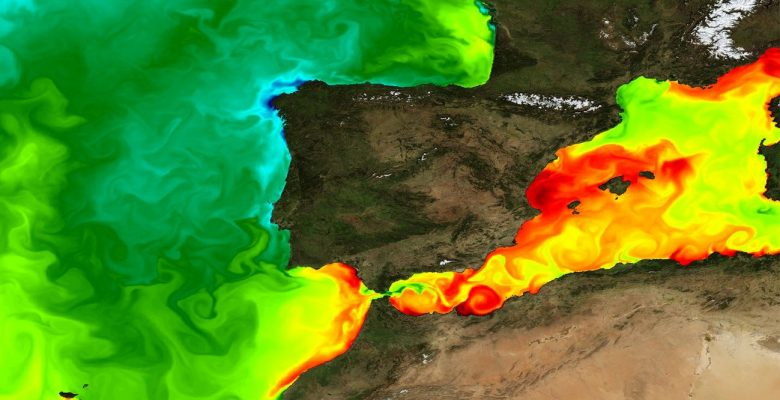

# The MEDIATION project

## What is going on

The project focuses on developing innovative tools and raise knowledge on ocean modelling, in order to better assess the impact of climate change on the global ocean and to efficiently inform stakeholders. It meets [the sixth challenge among the seven set out](https://www.ocean-climat.fr/Le-PPR/Les-defis-du-PPR) by the french Priority Research Program (PPR) named 'Océan et Climat'. It consists in a large-scale, multidisciplinary, publicly-funded initiative, determined by 3 main goals:

1) To better understand and adapt to how the global ocean responds to the climate change, 
2) To maintain and develop a sustainable anthropic exploitation of oceanic resources,
3) To reduce ocean pollution.

[The project description](https://oceansconnectes.org/mediation-un-jumeau-numerique-robuste-et-efficace-de-locean/) and [general information about the Océan et Climat program](https://www.ocean-climat.fr/) are available on their respective webpages.

## What is available

The [tools](https://github.com/MEDIATION-ocean/MEDIATION-catalog/blob/main/README.md#mediation-tools), [simulations](https://github.com/MEDIATION-ocean/MEDIATION-catalog/blob/main/README.md#mediation-simulations) and [observations](https://github.com/MEDIATION-ocean/MEDIATION-catalog/blob/main/README.md#mediation-observations) are listed and detailed [on the MEDIATION catalog](https://github.com/MEDIATION-ocean/MEDIATION-catalog/). They are either available by direct download on this repository, or by a hyperlink / access path.
Some datasets / toolboxes that could pick your interest are also pinned for direct access below.
    
    
